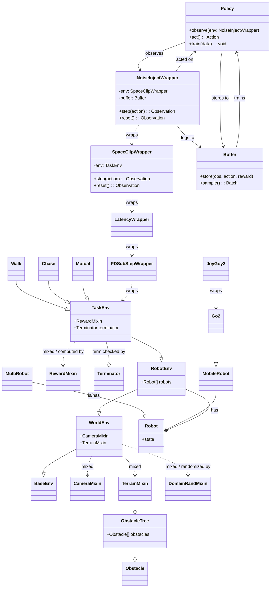

# tag

A collection of experiments and helper scripts around the brax and mujoco environments.

## Table of Contents
- [Installation](#installation)
- [Development](#development)
- [Directory Structure](#directory-structure)
- [Usage](#usage)
  - [Scripts](#scripts)
  - [Terrain](#terrain)

## Installation

The project uses the [uv](https://github.com/astral-sh/uv) package manager.

```bash
curl -LsSf https://astral.sh/uv/install.sh | sh
uv sync --extra brax --extra genesis --extra gl --extra debug
uv run main.py
```

## Protocol Interfaces



## Development

Install additional development tools and set up pre-commit hooks:

```bash
uv sync --dev
uvx pre-commit install
```

Formatting and linting are handled by [Ruff](https://docs.astral.sh/ruff/), so
the repository no longer includes Black or Isort hooks.

Unit tests can be run with `pytest`:

```bash
pytest
```

## Directory Structure

- `main.py` – example entry point for running environments.
- `tag/` – Python package with experimental code (e.g. `brax/barkour.py`). The
  directory now includes `__init__.py` files so modules can be imported.
- `extras/` – additional resources used in notebooks or experiments.
- `third-party/` – vendored dependencies or assets.
- `pyproject.toml` – project configuration and dependency list.

## Usage

Run experiments directly from the command line:

```bash
python main.py
```

### Scripts

`main.py` provides a simple script that demonstrates training or running Brax environments. Custom scripts can be added under the `tag` package as needed.

### Terrain

Example for creating a composite terrain in Genesis:

```python
import genesis as gs
gs.init(backend=gs.cpu)

scene = gs.Scene(show_viewer=True)
terrain = scene.add_entity(
    gs.morphs.Terrain(
        n_subterrains=(3, 3),
        subterrain_size=(12.0, 12.0),
        subterrain_types=[
            ['flat_terrain', 'random_uniform_terrain', 'stepping_stones_terrain'],
            ['pyramid_sloped_terrain', 'discrete_obstacles_terrain', 'wave_terrain'],
            ['random_uniform_terrain', 'pyramid_stairs_terrain', 'sloped_terrain']
        ],
        randomize=True
    )
)
```
